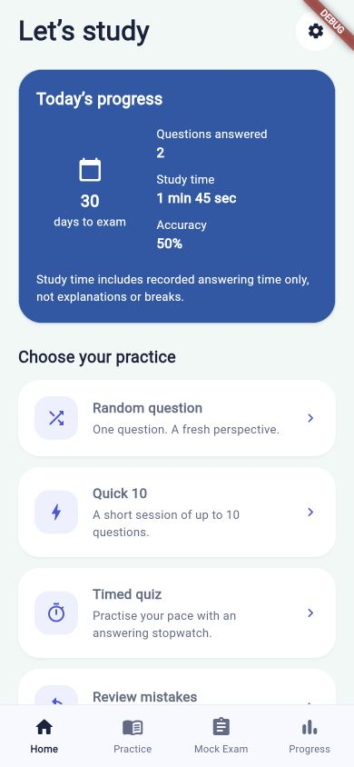
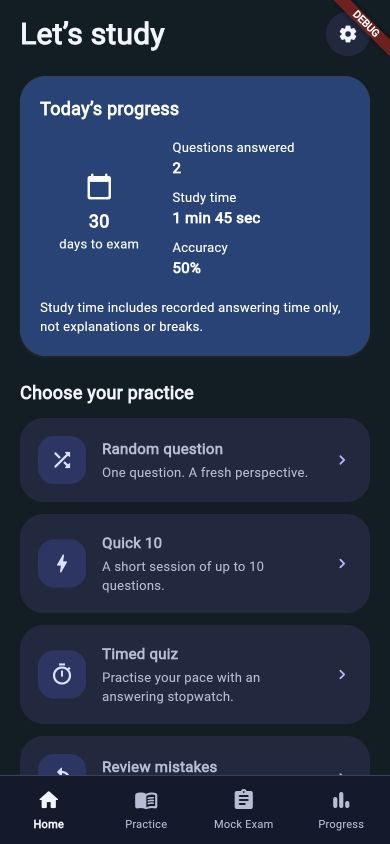
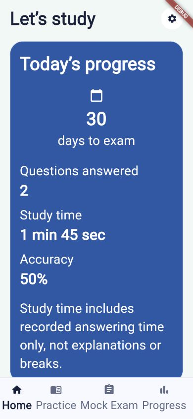

# Home practice chooser verification

Base: main `5062fdd` (merged PR #72). Branch: `feature/home-practice-chooser`.
No hosted Actions were dispatched. Commit and PR use `[skip ci]`; no merge.

## Existing behavior retained

PR #72 already removed the weekday/availability and experience steps. Inspection
of active screens, routes and bootstrap found no remaining weekday entry or
required availability gate. Welcome → exam timeframe → optional starting check →
Home remains intact. No schedule, content, access, prices or free-limit changes.

## Activity mapping

| Home action | Implementation |
| --- | --- |
| Random question | Existing PracticeGenerator eligibility/reserve/cap filters, explicit injected random shuffle before taking one; saves IDs/order before presenting the question. |
| Quick 10 | Existing practice controller, 10 requested; actual smaller pool/allowance requires explicit confirmation before saving/starting. Cancel saves nothing. |
| Timed quiz | New `PracticeMode.timedQuiz` through the same generator/controller and cap. A count-up active-answer stopwatch, not a countdown or auto-submit exam. |
| Review mistakes | Existing `PracticeFocus.incorrectQuestions`: questions missed at least once, even if later corrected. New practice does not rewrite earlier results. Disabled with “No mistakes to review” when history is empty. |
| Practice by topic | Existing generator `topicId` filter, now an actual topic picker rather than the overview's domain dropdown. |
| Mock exam | Existing MockExamScreen/blueprint/controller, including timing, entitlement and persistence rules. |
| Saved questions | Existing read-only answer/explanation library, including its empty state. |
| Continue session | Existing practice/diagnostic resume, or existing mock flow when no practice is active. Practice takes precedence if both exist; the mock tile still resumes its own exam. |
| Optional starting check | Existing diagnostic screen, separate from practice and mocks; history feeds Progress and weak/mistake practice. |

Selecting another mode while practice is unfinished uses the existing resume/new
session/cancel confirmation. No permutation is generated during build. Home
carries the bootstrap scope across routes so entitlement and repositories remain
available. Home reloads on tab return, pushed-route return and app foregrounding.

## Honest today data and time

Today uses append-only AnswerAttempt records and the captured local answer date.
Legacy records without that field fall back to the current device's local date.
Repeated answers count as separate attempts. Accuracy is correct/today attempts,
not unique-question accuracy, and is “—” when there are none.

The production mock flow currently persists aggregate MockAttempt data rather
than timestamped per-answer AnswerAttempt events. The card explicitly scopes its
numbers to practice and starting-check answers; it does not invent mock answer
dates from exam completion. Adding timestamped mock-answer statistics is separate
work. “Study time” is the sum of active answering seconds only; if any included
answer lacks a measurement, or no answers exist, it is “Not available”. It does
not report partial measurements as a complete total. No lifetime totals or daily
targets are presented as today's work.

The timed quiz reuses ActiveAnswerTimer: background/explanation time excluded,
each inactive segment capped at two minutes until interaction. Completed answers'
measured times persist and restore. Time spent on an unanswered question is not
saved and restarts on app relaunch. No automatic submission. Existing wall-clock
session elapsed time elsewhere keeps its historical meaning.

Schema remains **5**. `timedQuiz` is an additive mode string in the existing
session column; no migration, deletion, or rewriting of history. The old reader
already falls back to ordinary quickPractice for unknown mode strings, retaining
IDs/order/answers on rollback (the extra stopwatch label would be lost).

## Verification

- Red before green: new today-card/no-measurement Home regression failed against
  the old Home (“Today’s progress” absent), then passed after implementation.
- A first short-pool test caught an indefinitely animating loading indicator
  underneath the confirmation dialog; the launcher now marks the choosing state.
- Deterministic controlled-random selection, timed resume/answer-order/time,
  small pool confirm/cancel and exhausted UTC free allowance tests added.
- Home integration covers each tile, wrong-only selection, actual topic filtering,
  empty approved content, empty saved library, read retry, legacy planned resume,
  diagnostic resume, mock continuation, and exact/past/today/missing exam dates.
- Root demo integration covers editing an exact exam date from Home without
  onboarding reentry. Existing launch/skip/restart diagnostic, 100% no-mistakes,
  historical feedback and permutation tests remain in the full regression.
- Small 320×568 layout and 4× text tests in both themes remain enabled.

Final local Linux results (Flutter 3.41.2, local Lima `rhs-check`):

| Command | Actual output |
| --- | --- |
| `dart format --output=none --set-exit-if-changed lib test tool` | Formatted 255 files (0 changed). |
| `flutter analyze` | No issues found! |
| `flutter test` | 01:01 +1055 ~1: All tests passed! |
| product/profile `demo_entrypoint_mode_test.dart` guards | 1 test passed in each mode. |
| `dart run tool/validate_candidate_questions.dart --report` | Structurally valid: YES; 0 errors, 0 warnings. 26 candidates awaiting review; 0 approved; diagnostic preflight FAIL as expected. |

An exploratory host-macOS full run failed on all Linux image baselines and
outdated Home assertions. The Home assertions and missing Settings tooltip were
fixed. No non-Home image was regenerated: the full Linux run above passes all
42 exact golden comparisons. The platform-specific image differences were not
hidden with looser tolerances.

## Visual review and limitations

Attempted native run:

```sh
flutter run -d B91AEAC1-C5D9-44A3-B950-66F6969213F7 -t tool/main_study_preview.dart
```

`simctl` lists a booted iPhone 16, but Flutter's device discovery fails:
`CoreSimulatorService connection became invalid`, `Connection refused`, and
CoreSimulator log access `Operation not permitted`. No native iOS launch or
release build is claimed. Retry that command from the user's terminal outside
this sandbox; verify VoiceOver, device lifecycle and touch behavior there.

The main preview also cannot build for web because production composition imports
native SQLite FFI. A separate debug-only `tool/main_home_preview.dart` runs the
**real MainShell/Home and mode screens** with in-memory synthetic fixtures and
no production storage. It does not make the production application web-ready.

```sh
flutter run -d web-server --web-port 8194 -t tool/main_home_preview.dart
```

Open localhost:8194 with no query (light), `?theme=dark`, or `?scale=2`.
The preview deliberately labels itself DEBUG and uses synthetic test questions.
The three screenshots below are captures of running Flutter Web at 390×844,
not native iPhone screenshots or drawn mockups. They were opened and inspected.
At 2× text the progress card stacks; the activity list remains scrollable.
The existing bottom navigation is retained. These captures precede the final
footer clarification “Practice + starting check only”; final Linux Home goldens
include that text and were also inspected. Browser security denied access to the
restarted preview at localhost:8195 (“user declined permission”); no alternate
browser route or workaround was used to access that denied preview.





Six Linux Home goldens were intentionally updated and inspected. The comparator,
font harness, text scale and thresholds are unchanged. The harness uses placeholder
icon glyphs; running web captures show actual Material icons. Unchanged screen
baselines were not updated.
